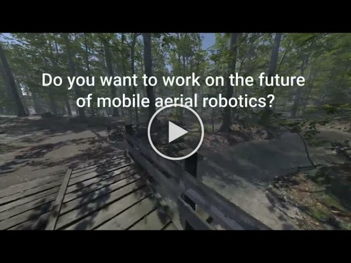

# DodgeDrone: Vision-based Agile Drone Flight (ICRA 2022 Competition)

[](https://www.youtube.com/watch?v=Dkc6JI_gsgs)


Would you like to push the boundaries of drone navigation? Then participate in the dodgedrone competition!
You will get the chance to develop perception and control algorithms to navigate a drone in both static and dynamic environments. Competing in the challenge will deepen your expertise in computer vision and control, and boost your research.
You can find more information at the [competition website](https://uzh-rpg.github.io/icra2022-dodgedrone/).

This codebase provides the following functionalities:

1. A simple high-level API to evaluate your navigation policy in the Robot Operating System (ROS). This is completely independent on how you develop your algorithm.
2. Training utilities to use reinforcement learning for the task of high-speed obstacle avoidance.

All evaluation during the competition will be performed using the same ROS evaluation, but on previously unseen environments / obstacle configurations.

## Flight API

This library contains the core of our testing API. It will be used for evaluating all submitted policies. The API is completely independent on how you build your navigation system. You could either use our reinforcement learning interface (more on this below) or add your favourite navigation system.

### Prerequisite

Before continuing, make sure to have g++ and gcc to version 9.3.0. You can check this by typing in a terminal `gcc --version` and `g++ --version`. Follow [this guide](https://linuxize.com/post/how-to-install-gcc-compiler-on-ubuntu-18-04/) if your compiler is not compatible.

In addition, make sure to have ROS installed. Follow [this guide](http://wiki.ros.org/noetic/Installation/Ubuntu) and install ROS Noetic if you don't already have it.

### Installation (for ROS User)

We only support Ubuntu 20.04 with ROS noetic. Other setups are likely to work as well but not actively supported.

Start by creating a new catkin workspace.

```
cd     # or wherever you'd like to install this code
export ROS_VERSION=noetic
export CATKIN_WS=./icra22_competition_ws
mkdir -p $CATKIN_WS/src
cd $CATKIN_WS
catkin init
catkin config --extend /opt/ros/$ROS_VERSION
catkin config --merge-devel
catkin config --cmake-args -DCMAKE_BUILD_TYPE=Release -DCMAKE_CXX_FLAGS=-fdiagnostics-color

cd src
git clone git@github.com:uzh-rpg/agile_flight.git
cd agile_flight
```

Run the `setup_ros.bash` in the main folder of this repository, it will ask for sudo permissions. Then build the packages.

```bash
./setup_ros.bash

catkin build
```

### Installation (for Python User)

If you want to develop algorithms using only Python, especially reinforcement learning, you need to install our library as python package.

**Make sure that you have [anaconda](https://www.anaconda.com/) installed. This is highly recommanded.**

Run the `setup_py.bash` in the main folder of this repository, it will ask for sudo permissions.

```bash
./setup_py.bash
```

### Task  

The task is to control a simulated quadrotor to fly through obstacle dense environments.
The environment contains both static and dynamic obstacles.
You can specifiy which difficulty level and environment you want to load for testing your algorithm.
The yaml configuration file is located in (/flightmare/flightpy/configs/vision/config.yaml.

```yaml
environment:
  level: "medium" # three difficulty level for obstacle configurations [easy, medium, hard]
  env_folder: "environment_0" # configurations for dynamic and static obstacles, environment number are between [0 - 100]

unity:
  scene_id: 0 # 0 warehouse, 1 garage, 2 natureforest, 3 wasteland
```

### Usage

The usage of this code base entails two main aspects: writing your algorithm and testing it in the simulator.

**Writing your algorithm:**

To facilitate coding of your algorithms, we provided a simple code structure for you, just edit the following file: [envtest/ros/user_code.py](https://github.com/uzh-rpg/agile_flight/blob/main/envtest/ros/user_code.py).
This file contains two functions, [compute_command_vision_based](https://github.com/uzh-rpg/agile_flight/blob/main/envtest/ros/user_code.py#L8) and [compute_command_state_based](https://github.com/uzh-rpg/agile_flight/blob/main/envtest/ros/user_code.py#L44).
In the vision-based case, you will get the current image and state of the quadrotor. In the state-based case, you will get the metric distance to obstacles and the state of the quadrotor. We strongly reccomend using the state-based version to start with, it is going to be much easier than working with pixels!

Depending on the part of the competition you are interested in, adapt the corresponding function.
To immediately see something moving, both functions at the moment publish a command to fly straight forward, of course without avoiding any obstacles.
Note that we provide three different control modes for you, ordered with increasing level of abstraction: commanding individual single-rotor thrusts (SRT), specifying mas-normalized collective thrust and bodyrates (CTBR), and outputting linear velocity commands and yawrate (LINVEL). The choice of control modality is up to you.
Overall, the more low-level you go, the more difficult is going to be to mantain stability, but the more agile your drone will be.

**Testing your approach in the simulator:**

Make sure you have completed the installation of the flight API before continuing.
To use the competition software, three steps are required:

1. Start the simulator

   ```
   roslaunch envsim visionenv_sim.launch render:=True
   # Using the GUI, press Arm & Start to take off.
   python evaluation_node.py
   ```

   The evaluation node comes with a config file. There, the options to plot the results can be disabled if you want no plots.
2. Start your user code. This code will generate control commands based on the sensory observations. You can toggle vision-based operation by providing the argument `--vision_based`.

   ```
   cd envtest/ros
   python run_competition.py [--vision_based]
   ```

3. Tell your code to start! Until you publish this message, your code will run but the commands will not be executed. We use this to ensure fair comparison between approaches as code startup times can vary, especially for learning-based approaches.

   ```
   rostopic pub /kingfisher/start_navigation std_msgs/Empty "{}" -1
   ```

If you want to perform steps 1-3 automatically, you can use the `launch_evaluation.bash N` script provided in this folder. It will automatically perform `N` rollouts and then create an `evaluation.yaml` file which summarizes the rollout statistics.

**Using Reinforcement Learning (Optional)**
We provide an easy interface for training your navigation policy using reinforcement learning. While this is not required for the competition, it could just make your job easier if you plan on using RL.

Follow [this guide](/envtest/python/README.md) to know more about how to use the training code and some tips on how to develop reinforcement learning algorithms

## Submission

More details about how to submit your code for evaluation will be released soon.
